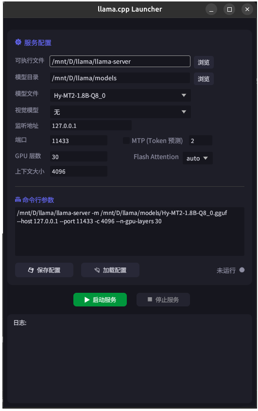

[🇺🇸 English](README.md) | [🇨🇳 中文](README.zh-CN.md)

---

<div align="center">

# 🦙 llama.cpp Launcher

> 基于 egui 的 llama.cpp 图形化启动器 | A GUI launcher for llama.cpp server




</div>

---

## ✨ 功能特性

| 功能 | 说明 |
|------|------|
| 🖥️ **图形化配置** | 无需记忆命令行参数，可视化配置 llama-server |
| 💾 **多配置管理** | 保存/加载命名配置，随时切换不同环境和模型 |
| 🌐 **自动语言适配** | 自动检测系统语言（中文/English） |
| 🧠 **高级参数支持** | GPU 层数、上下文大小、Flash Attention、MTP Token 预测 |
| 👁️ **视觉模型** | 支持 mmproj 视觉模型加载 |
| ⌨ **命令行预览** | 实时显示完整命令行，支持手动编辑额外参数 |
| 🚀 **一键启停** | 启动/停止服务，自动健康检查与端口冲突检测 |

---

## 🚀 快速开始

1. **选择可执行文件** — 浏览选择 llama-server
2. **选择模型目录** — 选择模型所在的文件夹
3. **选择模型文件** — 从下拉列表中选择模型
4. **配置参数** — 端口、GPU 层数、上下文大小等
5. **启动服务** — 点击「▶ 启动服务」按钮

> 💡 配置可以保存为命名配置，后续通过「📂 加载配置」快速切换。

---

## 📦 编译构建

### Linux

```bash
cargo build --release
```

产物：`target/release/llamacpp-launcher`

### Windows 交叉编译

需要安装 MinGW-w64：

```bash
sudo apt install mingw-w64
rustup target add x86_64-pc-windows-gnu
./build.sh x86_64-pc-windows-gnu
```

产物：`target/x86_64-pc-windows-gnu/release/llamacpp-launcher-win-x86_64.exe`

### 优化配置

`Cargo.toml` 已配置 Release 优化：
- LTO (链接时优化)
- Strip (移除调试符号)
- opt-level = "z" (最小体积)
- codegen-units = 1

---

## ⚙️ 配置文件

配置文件 `llamacpp_config.json` 保存在可执行文件同级目录，支持多配置存储：

```json
{
  "__meta__": { "last_profile": "本地开发" },
  "本地开发": {
    "executable": "/path/to/llama-server",
    "model_dir": "/path/to/models",
    "model_name": "model-name-q4_k_m",
    "mmproj": "",
    "host": "127.0.0.1",
    "port": 11433,
    "n_gpu_layers": 30,
    "ctx_size": 4096,
    "flash_attn": "auto",
    "mtp_enabled": false,
    "spec_draft_n_max": 2,
    "command_text": ""
  }
}
```

> ⚠️ 切换配置不会自动保存当前修改，需要手动点击「💾 保存配置」。

---

## 🧩 依赖

### Rust 依赖

| Crate | 用途 |
|-------|------|
| [eframe](https://github.com/emilk/egui) | GUI 框架 |
| [rfd](https://github.com/PolyMeilex/rfd) | 原生文件选择对话框 |
| [serde](https://github.com/serde-rs/serde) | 序列化 |
| [serde_json](https://github.com/serde-rs/json) | JSON 配置持久化 |
| [ureq](https://github.com/algesten/ureq) | HTTP 健康检查 |
| [sys-locale](https://github.com/rust-utils/sys-locale) | 系统语言检测 |

### 系统依赖

- **Linux**: `psmisc`（提供 `fuser`，用于端口冲突检测）
  ```bash
  sudo apt install psmisc
  ```
- **Windows 交叉编译**: `mingw-w64`

---

## 📄 许可证

MIT License
